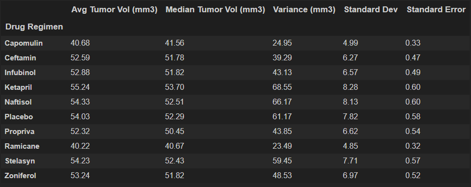
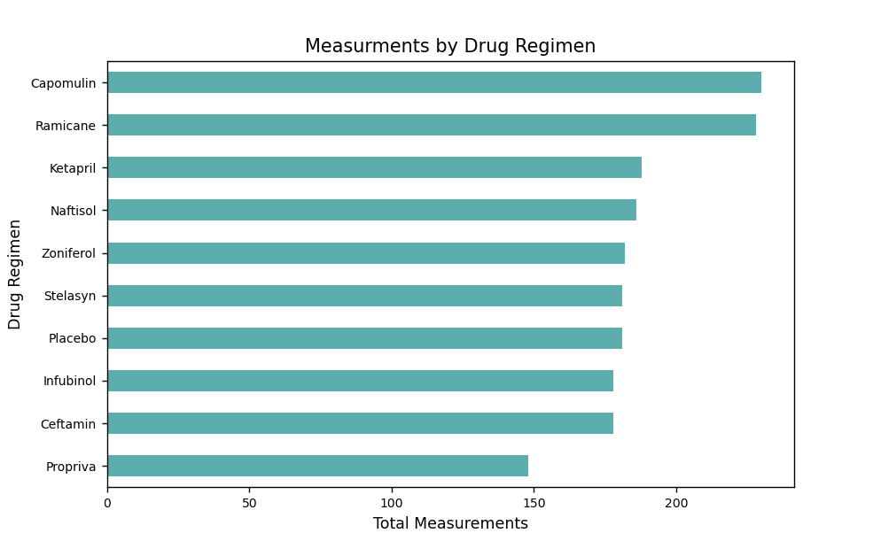
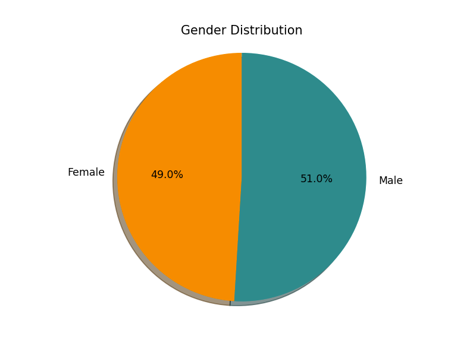
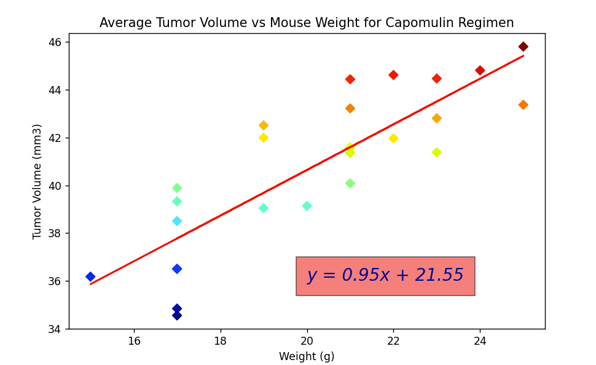
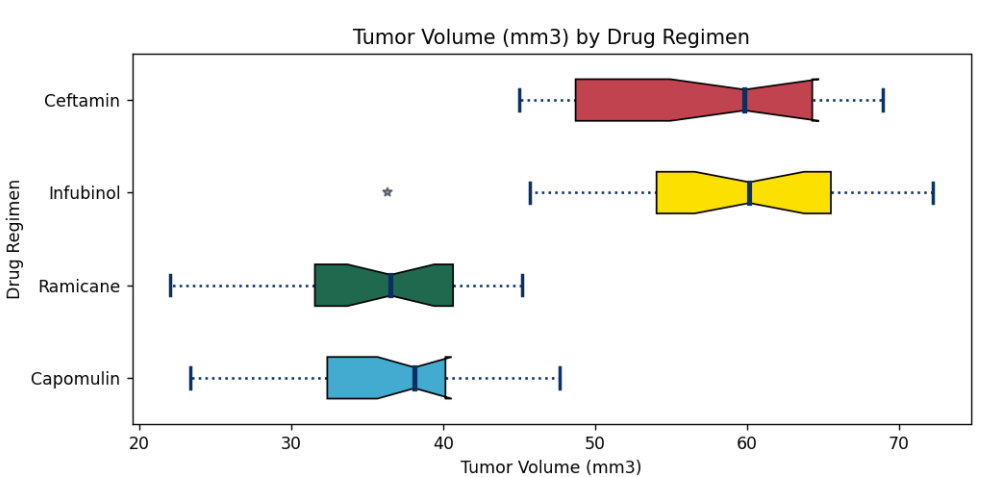
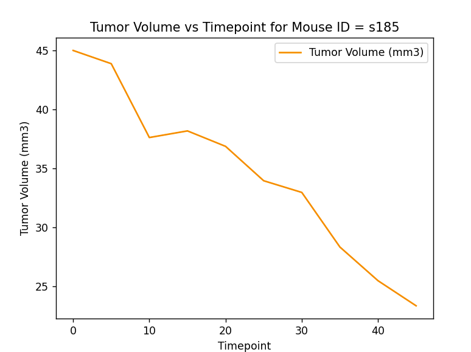

# Pymaceuticals Inc.

---
---
## Project Background
While your data companions rushed off to jobs in finance and government, you remained adamant that science was the way for you. Staying true to your mission, you've joined Pymaceuticals Inc., a burgeoning pharmaceutical company based out of San Diego. Pymaceuticals specializes in anti-cancer pharmaceuticals. In its most recent efforts, it began screening for potential treatments for squamous cell carcinoma (SCC), a commonly occurring form of skin cancer.

As a senior data analyst at the company, you've been given access to the complete data from their most recent animal study. In this study, 249 mice identified with SCC tumor growth were treated through a variety of drug regimens. Over the course of 45 days, tumor development was observed and measured. The purpose of this study was to compare the performance of Pymaceuticals' drug of interest, Capomulin, versus the other treatment regimens. You have been tasked by the executive team to generate all of the tables and figures needed for the technical report of the study. The executive team also has asked for a top-level summary of the study results.

Reference material in csv format may be found in the available 'Resources' folder within the repository. 

---
## Summary & Demographic Statistics

*Table 1: Summary Statistics*

* Capomulin shows second lowest mean and median tumor volume
* Ramicane top performer in summary statistics 
* Many treatments tracking close to placebo 

*Figure 1: Total Measurements by Drug Regimen*

* Most test measurments taken over Capomulin and Ramicane treated mice
* Remaining treatments tracking test sample size with placebo

*Figure2: Gender Distribution by Subject*

* Even distribution between male and female test subjects in study

---
## Results

When compared to two drug regimens tracking close to placebo in terms of summary statistics, both Capomulin and Ramicane show very promising reductions in tumor volume over time.

*Figure 3: Average Tumor Volume vs Subject Weight*

* Relatively even tumor size distribution within Capomulin subset

*Figure 4: Top verus Baseline Treatment Performers*

* Capomulin results show most consistent tumor size reduction

*Figure 5: Example Capomulin Performance*

* Near 1:1 reduction in tumor volume over time with Capomulin treatment

